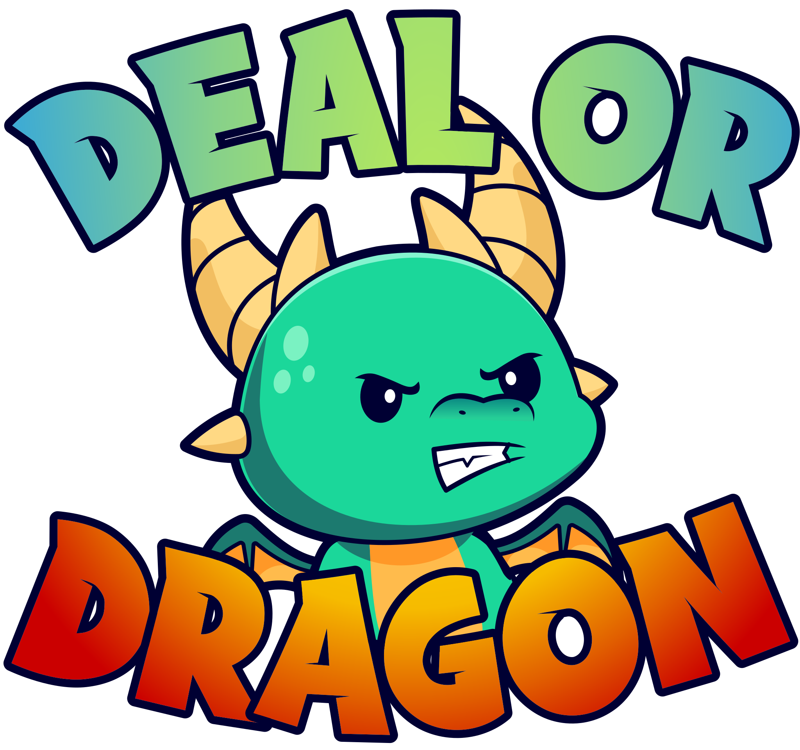

  

# Deal or Dragon

**Deal or Dragon**, formerly known as Chatbot Challenge, is a standard dungeon crawler with a twist: instead of *fighting* the monsters, you are trying to convince them to *buy* an item.

## Collaborators
* Len Kedrow | [LinkedIn](https://www.linkedin.com/in/len-kedrow-72abb969/) | [GitHub](https://github.com/Len-Kedrow)
* Kyle Bleeker | [LinkedIn](https://www.linkedin.com/in/kyle-bleeker-a0b7382b8/) | [GitHub](https://github.com/ksbleek)
* Brandon Yeoh | [LinkedIn](https://www.linkedin.com/in/brandon-yeoh/) | [GitHub](https://github.com/byeoh100)
* Erika Holzinger | [LinkedIn](https://www.linkedin.com/in/erikaholzinger/details/experience/) | [GitHub](https://github.com/iamAtomika)
* Christopher Roberts | [LinkedIn](https://www.linkedin.com/in/christopher-roberts-90682a170/) | [GitHub](https://github.com/ChrisRoberts13)

## Features
* **Account Creation**
    * Users can create an account to track characters and wins/losses.
* **Unique characters**
    * User created characters have stat points that can be allocated to influence the way that the monsters percieve you.
* **AI powered**
    * Each monster is a custom-trained ChatGPT chatbot model that responds accordingly to the conversation with the player.
    * AI powered monsters allow for a unique and reactive playthrough on every interaction.

## How to install and run
To run the backend:  
* `cd backend`
* `pip install -r requirements.txt`
* `cd chatbot_proj`
* `python manage.py runserver`

To run the frontend:  
* `cd frontend/chatbot`
* `npm install`
* `npm run dev`

## Built With:
* React/Vue
* Django
* PostgreSQL
* ChatGPT